# AWS VPC Project Guide
 
A step-by-step walkthrough of building a Virtual Private Cloud (VPC) on AWS, with explanations for *why* each component exists and what it does.


 
---
 
## Prerequisites
 
1. **Create an AWS account** — your root account is the master account tied to billing.
2. **Create an IAM user** with Administrator access, then log out of root and work from the IAM account going forward.
> **Why use an IAM user instead of root?** The root account has unrestricted access to everything — including billing and account deletion. Best practice is to only use root for account-level tasks and do all day-to-day work from an IAM user. This limits the blast radius if credentials are ever compromised.
 
3. **Switch to your closest AWS region** (top-right of the console). Choosing a nearby region reduces latency and keeps data residency predictable.

---
 
## Cleaning Up: Why You Should Delete Unused Resources
 
Once you're done with this project, delete everything you created. This isn't optional housekeeping — it's an important habit to build early.
 
AWS charges for resources whether you're actively using them or not. EC2 instances accrue hourly compute charges as long as they're running. NAT gateways (if you had created one) charge by the hour *plus* per GB of data processed. Elastic IPs that are allocated but not attached to a running instance also incur charges. None of these costs are large individually, but forgotten resources across multiple learning projects add up quickly and can lead to a surprising bill at the end of the month.
 
Beyond cost, leaving unused resources around creates security exposure. An EC2 instance sitting idle is still a potential attack surface — especially if its security group allows inbound SSH from anywhere, as this project's public server does. There's no reason to leave that window open once the project is done.
 
**Delete resources in this order** (dependencies must be removed before the things they depend on):
 
1. **EC2 instances** — terminate both the public and private servers first.
2. **NAT gateway** (if created) — must be deleted before the IGW and subnets.
3. **Release Elastic IPs** (if any were allocated).
4. **VPC** — deleting the VPC will automatically remove its subnets, route tables, internet gateway association, NACLs, and security groups in one step. Use the VPC console's delete action for the cleanest teardown.
5. **Key pair** — delete it from the EC2 Key Pairs console, and delete the `.pem` file from your local machine if you no longer need it.
> Getting into the habit of cleaning up after every learning project will save you money, keep your AWS console uncluttered, and make it easier to understand what's running in your account at any given time.

---
 
## Step 1: Create a VPC
 
Navigate to **VPC → Your VPCs → Create VPC**.


 
- **Name:** `VPC-Project`
- **IPv4 CIDR block:** `10.0.0.0/16`
> **Why create a VPC?** A VPC (Virtual Private Cloud) is your own logically isolated section of the AWS cloud. Think of it as your private data center within AWS — you control the IP address ranges, subnets, routing, and network access rules. Without a VPC, you have no control over network isolation between your resources.
 
> **Why `10.0.0.0/16`?** This is a private IP range (RFC 1918) giving you 65,536 IP addresses to work with. The `/16` prefix is the VPC-level block — subnets will carve smaller chunks out of it.


 
---
 
## Step 2: Create a Public Subnet
 
Navigate to **Subnets → Create Subnet**.


 
| Setting | Value |
|---|---|
| VPC ID | VPC-Project |
| Subnet name | Public 1 |
| Availability Zone (AZ) | First AZ in the list |
| IPv4 VPC CIDR block | 10.0.0.0/16 |
| IPv4 subnet CIDR block | 10.0.0.0/24 |


 
After creating, select the subnet → **Actions → Edit subnet settings** → enable **Auto-assign public IPv4 address**.


 
> **Why a subnet?** A subnet segments your VPC's IP space into smaller blocks. Resources (like EC2 instances) live in subnets, not directly in the VPC. This lets you separate public-facing resources from internal ones.
 
> **Why `10.0.0.0/24`?** The `/24` gives you 256 addresses within the VPC's `/16` block — a reasonable size for a public-facing tier.
 
> **Why enable auto-assign public IPv4?** Resources in a public subnet need a public IP to be reachable from the internet. Auto-assigning saves you from manually attaching an Elastic IP to every instance you launch here.
 
---
 
## Step 3: Create an Internet Gateway


Navigate to **Internet Gateways → Create Internet Gateway**, then:
 
**Actions → Attach to VPC → VPC-Project**


 
> **Why an internet gateway?** An internet gateway (IGW) is what connects your VPC to the public internet. Without one, all traffic stays private — no inbound or outbound internet connectivity. Attaching it to the VPC makes internet access *possible*, but routing rules still control which subnets actually use it.
 
---
 
## Step 4: Create and Configure a Route Table
 
Navigate to **Route Tables** and find the table associated with your `10.0.0.0/16` VPC. If multiple routing tables, rename to "VPC Project Routing Table" to find easily.


 
### Add an internet route
**Routes tab → Edit routes → Add route:**
 
| Field | Value |
|---|---|
| Destination | 0.0.0.0/0 |
| Target | Internet Gateway (your previously created IGW) |
 
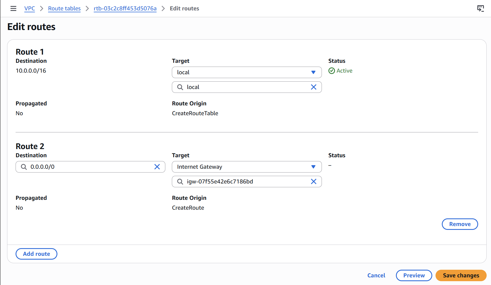

Associate the subnet by: **Go back to dahsboard → Subnet associations tab → Edit subnet associations → Select Public 1 → Save.**
 
> **Why add a `0.0.0.0/0` route?** This is the "default route" — it tells the subnet: *for any traffic destined anywhere on the internet, send it through the IGW.* Without this route, even with an IGW attached to the VPC, your subnet has no path to reach the internet.
 
> **Why associate the subnet?** Route tables only apply to subnets that are explicitly associated with them. Associating `Public 1` with this route table is what makes it a *public* subnet — the IGW route is now in effect for resources launched here.

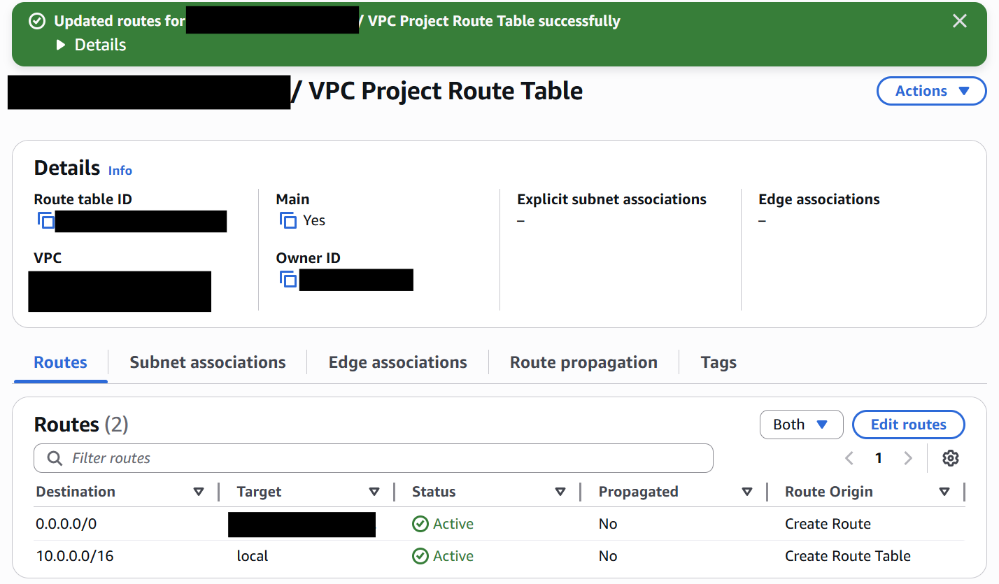
 
---
 
## Step 5: Create a Security Group
 
Navigate to **Security Groups → Create security group**.

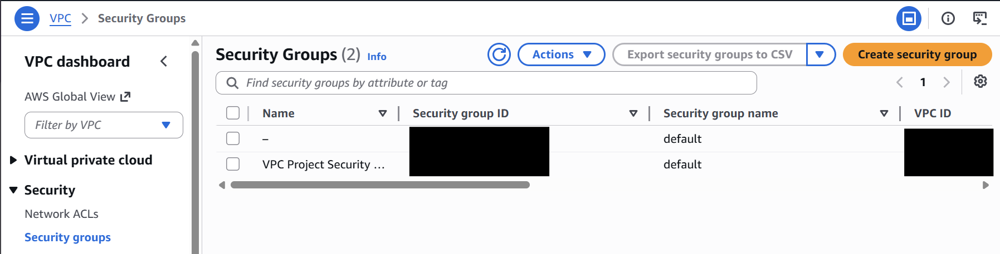
 
| Setting | Value |
|---|---|
| Name | VPC Project Security Group |
| Description | A Security Group for the VPC-Project |
| VPC | VPC-Project |

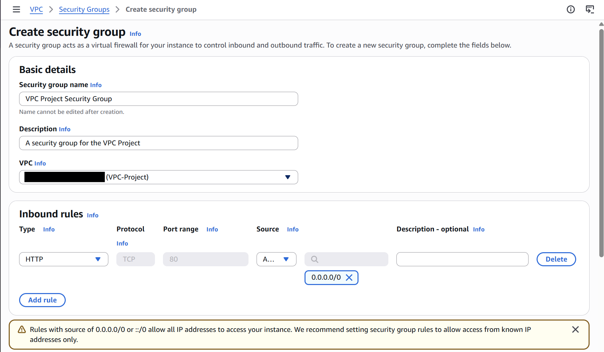
 
Under the Inbound rules panel, choose Add rule. **Inbound rule:**

| Type | Source |
|---|---|
| HTTP | Anywhere-IPv4 (0.0.0.0/0) |

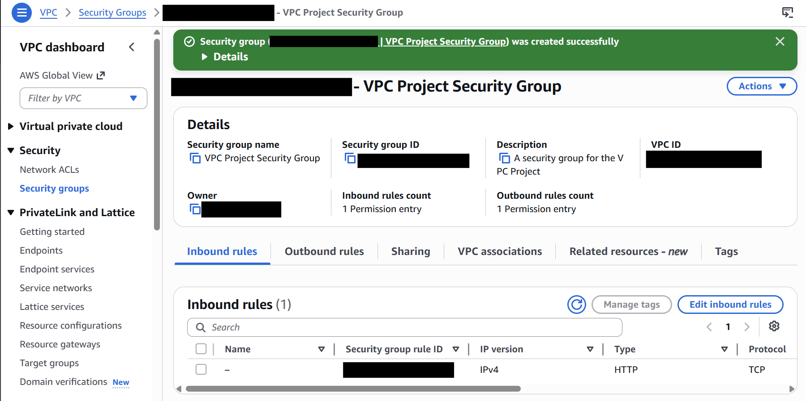
 
> **Why a security group?** Security groups act as a virtual firewall at the *instance* level. They are stateful — if you allow inbound traffic, the response is automatically allowed out, regardless of outbound rules. Every EC2 instance must belong to at least one security group.
 
> **Why allow HTTP from anywhere?** This lets any internet user send web requests to your public server on port 80. In a real production environment you'd typically also add HTTPS (port 443) and restrict sources more tightly.
 
---
 
## Step 6: Create a Network ACL (NACL)

Go to the Network ACL dashboard and find the ACL associated with Public 1. Check out the Inbound and Outbound rules.

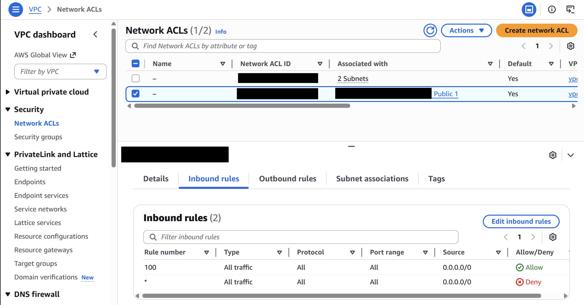

Navigate to **Network ACLs → Create network ACL**. Name it **VPC Project ACL**

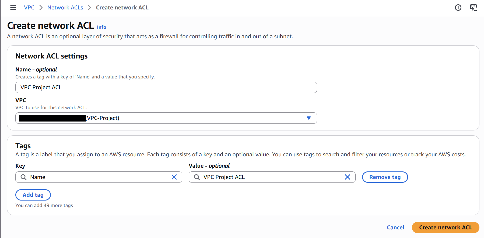

Once created, select the new ACL created.

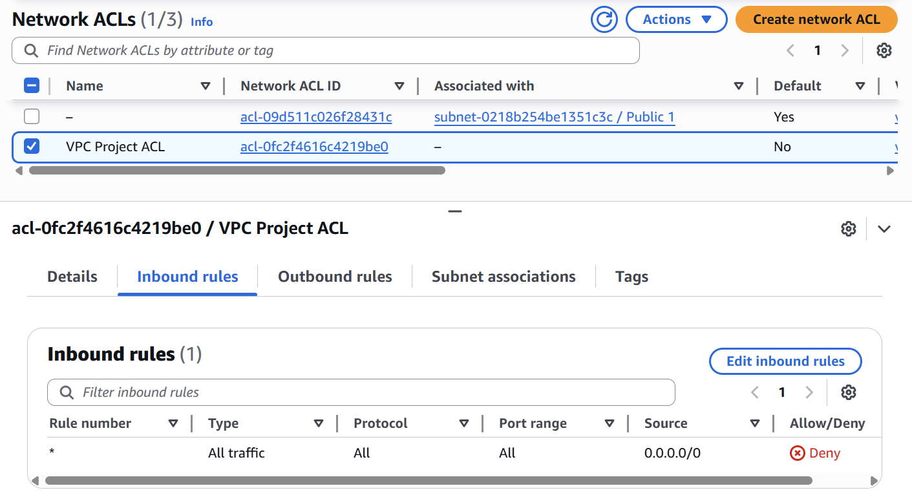

Under **Inbound rules → Add rule:**

| Rule # | Type | Source |
|---|---|---|
| 100 | All traffic | 0.0.0.0/0 |

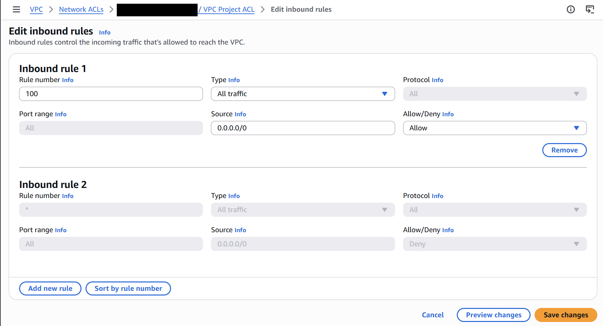
 
Apply the **same rule to Outbound rules**.

Under **Subnet associations**, associate with **Public 1**.

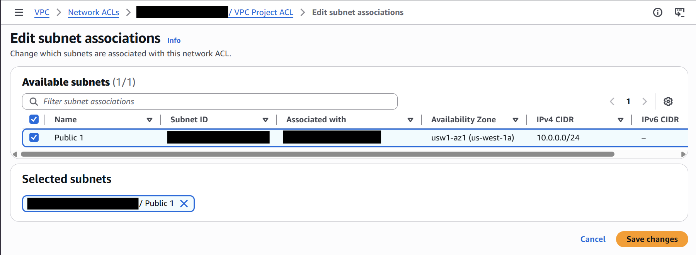

> **Why a Network ACL in addition to a Security Group?** NACLs operate at the *subnet* level and are stateless — meaning you must explicitly allow both inbound and outbound traffic for a connection to work. They provide a second layer of defense. If a Security Group is the inner door lock, the NACL is the building's front gate.
 
> **Why rule number 100?** NACLs evaluate rules in ascending numeric order and stop at the first match. Using 100 (with room to insert rules like 50 or 90 later) is a common convention, leaving space for more specific rules to be added above it in the future.
 
---
 
## Step 7: Create a Private Subnet
 
Navigate to **Subnets → Create Subnet**.
 
| Setting | Value |
|---|---|
| VPC ID | VPC-Project |
| Subnet name | VPC Project Private Subnet |
| Availability Zone | **Second** AZ in the list |
| IPv4 VPC CIDR block | 10.0.0.0/16 |
| IPv4 subnet CIDR block | 10.0.1.0/24 |

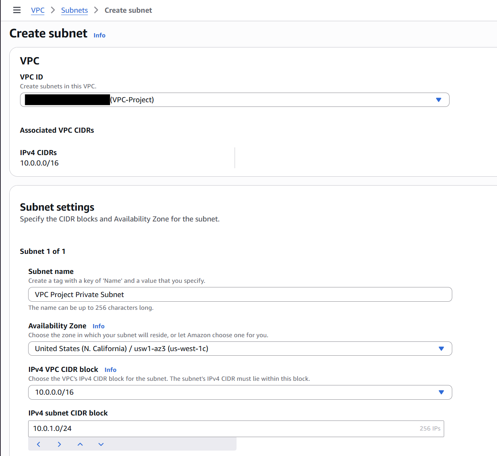

Rename Public 1 to VPN Project Public subnet. Should now have 2 separate subnets, a public and private one.
 
> **Why a different AZ?** Placing your public and private subnets in different Availability Zones improves fault tolerance. If one AZ goes down, resources in the other AZ remain available.
 
> **Why `10.0.1.0/24`?** This is the next non-overlapping `/24` block within the VPC's `10.0.0.0/16` range — keeping subnets cleanly separated.
 
> **Why no public IP auto-assign?** A private subnet should never have direct internet access. Leaving auto-assign off means instances here won't receive public IPs, and since there's no IGW route, they're isolated from the internet by design.

---
 
## Step 8: Create a Private Route Table
 
Navigate to **Route Tables → Create route table**.
 
| Setting | Value |
|---|---|
| Name | VPC Project Private Route Table |
| VPC | VPC-Project |

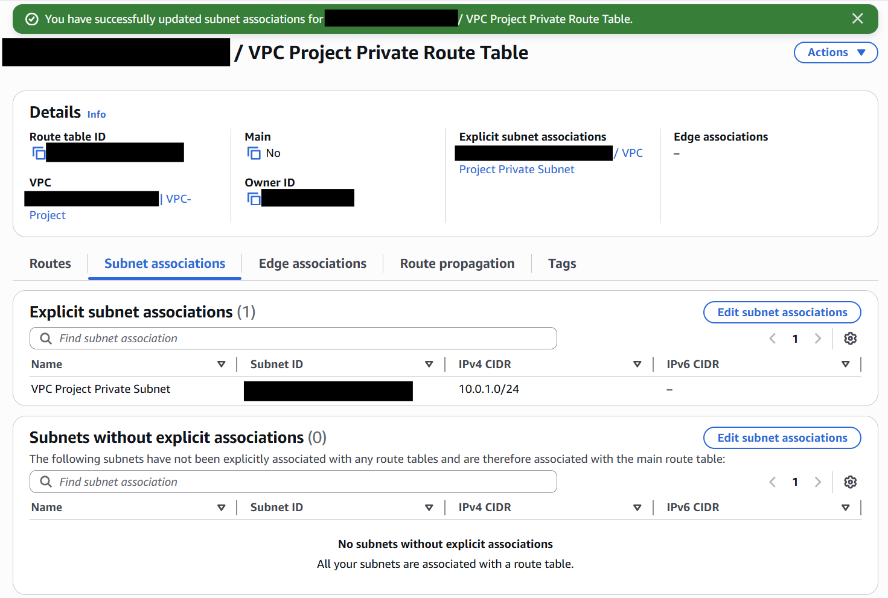
 
**Subnet associations → Edit → Select VPC Project Private Subnet → Save.**

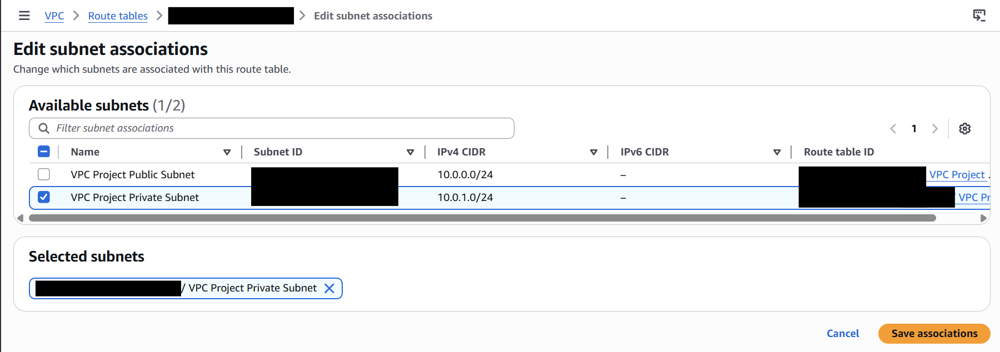
 

Renamed VPC Project Route Table to VPC Project Public Route Table.
 
> **Why a separate route table for the private subnet?** The public route table has a route to the IGW (`0.0.0.0/0 → IGW`). If the private subnet used the same table, it would have internet access — defeating the purpose of making it private. A dedicated route table with *no* IGW route keeps the private subnet isolated.
 
---
 
## Step 9: Create a Private Network ACL
 
Navigate to **Network ACLs → Create network ACL**.
 
- Name: `VPC Project Private NACL`
- VPC: `VPC-Project`

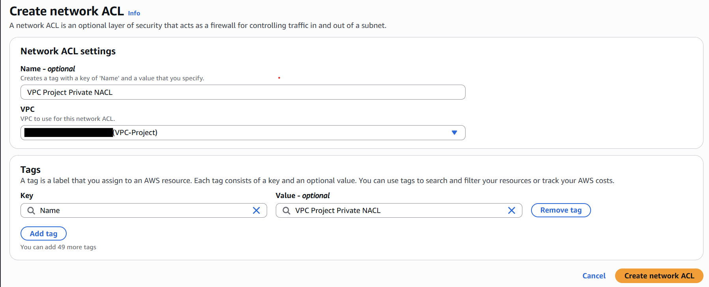

Switch tabs to Subnet associations. Select Edit subnet associations. Associate with **VPC Project Private Subnet**.

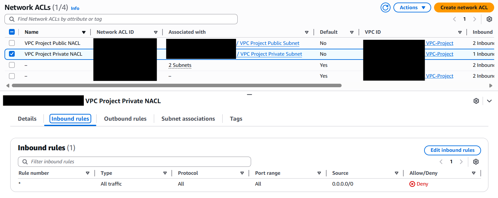

Leave inbound and outbound rules as **Deny all** for now.

Rename the public ACL to VPC Project Public NACL.

> **Why deny everything by default?** The principle of least privilege — start with no access and only open what's explicitly needed. This is safer than allowing everything and trying to block specific threats.
 
---
 
## Step 10: Launch EC2 Instances
 
### Public Server
 
Navigate to **EC2 → Launch Instances**.

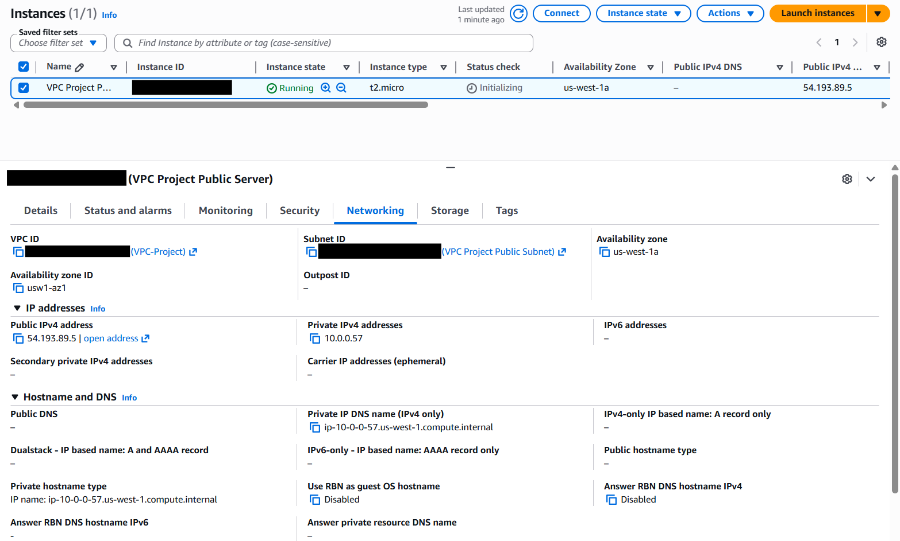
 
| Setting | Value |
|---|---|
| Name | VPC Project Public Server |
| AMI | Amazon Linux 2023 |
| Instance type | t2.micro |
| Key pair | Create new: `VPC Project key pair` (RSA, .pem) |
| VPC | VPC-Project |
| Subnet | VPC Project Public Subnet |
| Security group | VPC Project Security Group (existing) |

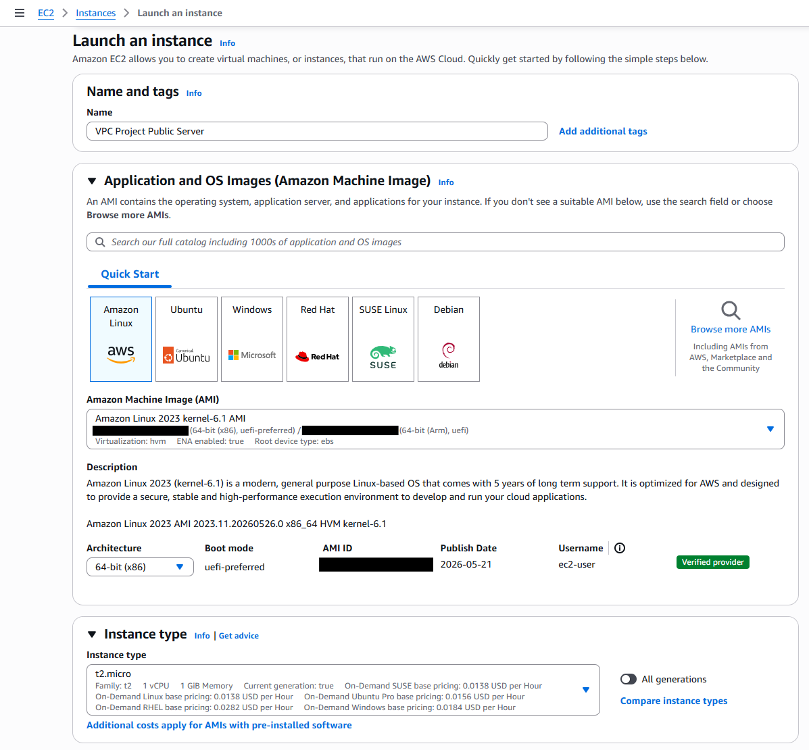
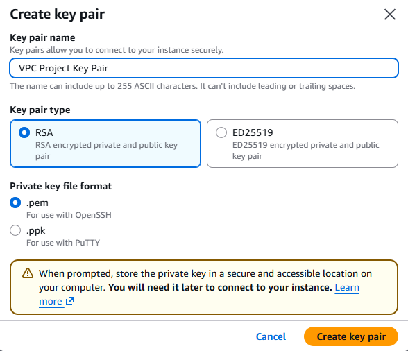

At the Network settings panel, select Edit at the right hand corner.
- Select VPC-Project from the drop-down in the VPC list.
- Select your public subnet (VPC Project Public Subnet).
- For the Firewall (security groups), we've already created the security group for your public subnet's resources. Choose Select existing security group. Select VPC Project Security Group. 

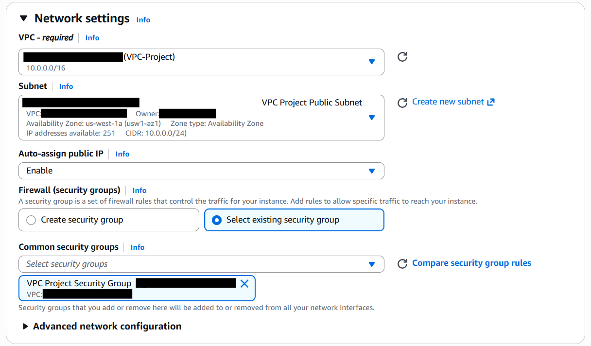

Create Instance.
 
> **Why save the .pem key file carefully?** This is your only copy of the private key used for SSH authentication. AWS does not store it — if you lose it, you lose the ability to connect to any instance using that key pair.
 
> **After launching:** Check the **Networking** tab on the instance — it should have a **Public IPv4 address**, confirming it's reachable from the internet.
 
---
 
### Private Server
 
Launch another instance with:
 
| Setting | Value |
|---|---|
| Name | VPC Project Private Server |
| AMI | Amazon Linux 2023 |
| Instance type | t2.micro |
| Key pair | VPC Project key pair |
| VPC | VPC-Project |
| Subnet | VPC Project Private Subnet |
| Security group | Create new: `VPC Project Private Security Group` |
 
At the Network settings panel, select Edit at the right hand corner.
- Select VPC-Project from the drop-down in the VPC list.
- Select your public subnet (VPC Project Public Subnet).
- For the Firewall (security groups), We are creating a new security group.
- Select Create security group.
- For Security group name, let's use VPC Project Private Security Group
- For Description, we'll replace the default value with Security group for VPC Project Private Subnet.
- Notice the default Inbound Security Groups, the Type is set to ssh.

**Private Security Group inbound rule:**
 
| Type | Source type | Source |
|---|---|---|
| SSH | Custom | VPC Project Security Group |
 
> **Why use the Public Security Group as the source (not an IP range)?** By referencing a security group as the source, you're saying "only instances that are *members* of the Public Security Group can SSH in." This is more robust than a CIDR range — it doesn't break if IP addresses change, and it's more semantically meaningful.
 
> **Notice:** The Private Server has a **Private IPv4 address only** — no public IP. It's not directly reachable from the internet. 

>The Public server has both a public and private IP.
 
---
 
## Step 11: Connect to the Public Server
 
1. In the EC2 console, select **VPC Project Public Server → Connect**.

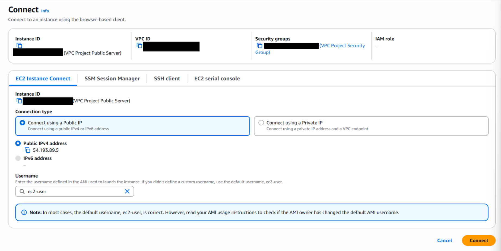

2. Use **EC2 Instance Connect** with default settings.
**If you get an error**, investigate in this order:
- **Route table** — does the public subnet route to the IGW? ✅
- **Network ACL** — are the inbound/outbound rules permitting traffic? ✅
- **Security group** — aha! The security group only allows HTTP (port 80), but EC2 Instance Connect uses **SSH (port 22)** to connect.
**Fix:** Edit the Security Group's inbound rules and add:
 
| Type | Source |
|---|---|
| SSH | Anywhere-IPv4 |
 
> **Note:** In a production environment, you'd restrict SSH to a specific CIDR block (e.g., your office IP or EC2 Instance Connect's published IP ranges) rather than `0.0.0.0/0`. For this project, anywhere is acceptable.

Go back to the EC2 console, select **VPC Project Public Server → Connect**. A terminal should pop up if the connection is successful.

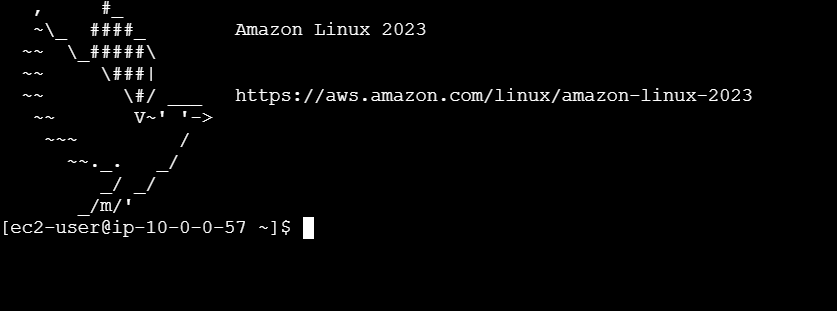
 
---
 
## Step 12: Connect to the Private Server (via the Public Server)
 
The private server is not directly reachable from the internet — you access it by "hopping" through the public server.
 
1. From the EC2 console, copy the **Private IPv4 address** of your private server (e.g., `10.0.1.49` for me).
2. In the EC2 Instance Connect terminal on the public server, try to ping it:
   ```bash
   ping <Your private IP address>
   ```
   This will **fail** — ICMP traffic is blocked by default and ping is ICMP traffic.

**Fix the private NACL (Inbound):**
 
| Rule # | Type | Source |
|---|---|---|
| 100 | All ICMP - IPv4 | 10.0.0.0/24 |
 
**Fix the private NACL (Outbound):**
 
| Rule # | Type | Destination |
|---|---|---|
| 100 | All ICMP - IPv4 | 10.0.0.0/24 |
 
**Fix the private Security Group (Inbound):**
 
| Type | Source |
|---|---|
| All ICMP - IPv4 | VPC Project Security Group |
 
> **Why do NACLs need both inbound AND outbound rules, but security groups only need one?** Security groups are **stateful** — allowing inbound traffic automatically allows the response out. NACLs are **stateless** — each direction of traffic is evaluated independently, so you must explicitly allow both directions for a two-way exchange.
 
> **Why is the NACL source a CIDR block (`10.0.0.0/24`) while the Security Group source is a Security Group name?** NACLs only understand IP addresses/CIDR ranges — they operate at a lower network layer and have no awareness of AWS constructs like security groups. Security groups, operating at the instance level, can reference other security groups directly for more flexible and maintainable rules.
 
After making these changes, the ping should succeed and you'll see continuous ICMP reply messages in the terminal.
 
---
 
## Step 13: Verify Internet Connectivity

If pings are still running, use CTRL + C to end.
 
Still connected to the public server via EC2 Instance Connect, run:
 
```bash
curl example.com
```
 
You should receive HTML back from `example.com`. This confirms the full path works:
 
**Your browser → IGW → Public Subnet → Public Server → IGW → Internet**

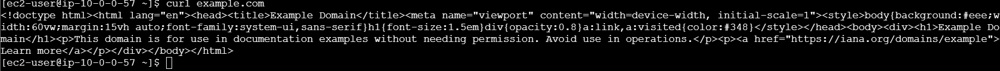
 
---

## Bonus: Creating a VPC Quickly with "VPC and More"
 
Everything built in this guide was assembled piece by piece — VPC, subnets, route tables, IGW, NACLs — each as a separate step. That's intentional: doing it manually forces you to understand what each component is and how they connect. Now that you have that foundation, here's the faster way AWS lets you do it all at once.
 
### Using the "VPC and More" Option
 
Navigate to **VPC → Your VPCs → Create VPC**, then select **VPC and more** instead of "VPC only."
 
> **Why does this option exist?** In practice, you almost always need subnets, route tables, and an IGW alongside a VPC — they're only useful together. "VPC and more" bundles all of that creation into a single guided form, saving time and reducing the chance of misconfiguration from forgetting a step.
 
A **resource map** appears on the right side of the screen as you fill in the form. It's a live preview that updates in real time as you change settings — hover over any component to see how it connects to the others.
 
> **Why is the resource map useful?** It makes the relationships between components visual and immediate. When you did this manually, it required mental bookkeeping to track which subnet was associated with which route table, which IGW, and so on. The map makes those links obvious at a glance — and it's a great sanity check before committing to creation.

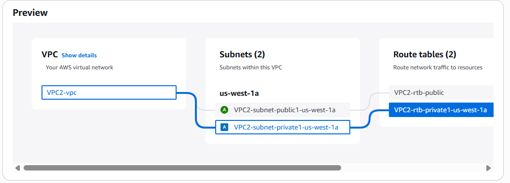
 
### Configuration Settings
 
Work through the form with these settings:
 
| Setting | Value | Notes |
|---|---|---|
| Name tag auto-generation | `VPC Project` | AWS uses this to auto-name all child resources (subnets, route tables, etc.) |
| IPv4 CIDR block | `10.0.0.0/16` | Pre-filled — same range as the manual build |
| IPv6 CIDR block | None | Not needed for this project |
| Tenancy | Default | Shared hardware; Dedicated tenancy costs significantly more |
| Number of AZs | 1 | Change from the default of 2 — one AZ keeps things simple here |
| Number of public subnets | 1 | |
| Number of private subnets | 1 | Change from the default of 2 |
| Public subnet CIDR | `10.0.0.0/24` | Matches what was built manually |
| Private subnet CIDR | `10.0.1.0/24` | Matches what was built manually |
| NAT gateways | **None** | See note below |
| VPC endpoints | None | Not needed for this project |
| DNS options | Leave checked | Enables hostname resolution within the VPC |
 
> **Why set AZs to 1?** The default of 2 AZs would create 2 public and 2 private subnets — more than needed here. Changing to 1 AZ mirrors the simpler architecture from the manual build: one public subnet, one private subnet. Watch the resource map update as you change this value.
 
> **Why skip the NAT gateway?** A NAT (Network Address Translation) gateway allows instances in a *private* subnet to initiate outbound internet traffic (e.g., to download software updates) while still being unreachable from the internet. It's a genuinely useful component — but AWS charges an hourly fee plus data processing costs for it. For this learning project, skipping it avoids unexpected charges. In a real deployment where private instances need outbound internet access, you'd enable it.
 
Once your settings are in place, select **Create VPC**. AWS will provision all the components simultaneously — VPC, subnets, route tables, and IGW — and show you a progress screen as each resource is created.
 
### Comparing the Two VPCs
 
After creation, head to the **VPC dashboard** and compare the resource map of your new VPC against the one built manually earlier. They should look structurally identical — the same components, the same relationships — just arrived at by two different paths.
 
> **The takeaway:** "VPC and more" isn't magic — it creates the exact same underlying resources you built by hand. Knowing what each piece does (from the earlier steps) means you can use this shortcut confidently, and you'll know exactly where to look when something needs adjusting later.

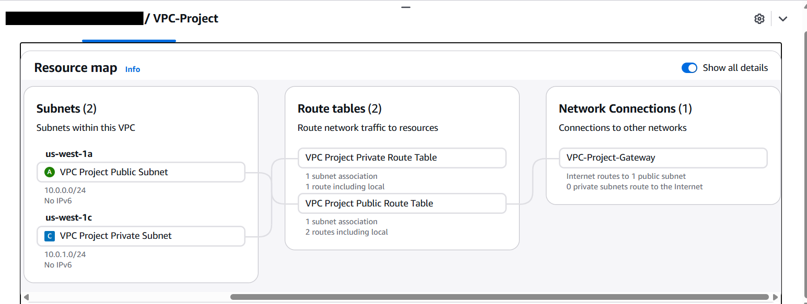
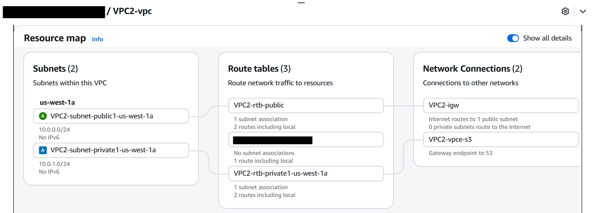
 
---
 
## Key Concepts Recap
 
| Component | Level | Stateful? | Purpose |
|---|---|---|---|
| Security Group | Instance | ✅ Yes | Controls traffic to/from individual resources |
| Network ACL | Subnet | ❌ No | Subnet-level firewall, rules evaluated in order |
| Route Table | Subnet | — | Determines where network traffic is directed |
| Internet Gateway | VPC | — | Connects VPC to the public internet |
| Public Subnet | VPC | — | Subnet with a route to the IGW |
| Private Subnet | VPC | — | Subnet with no route to the IGW |
 
---
 
## What I Learned
 
This project was a hands-on introduction to cloud networking on AWS — not just clicking through a console, but understanding *why* each component exists and how they work together. Here's what it covered:
 
**Core AWS networking concepts.** Building a VPC from scratch meant working through the full network stack: defining an IP address space with CIDR blocks, creating subnets to segment that space, and configuring route tables to control where traffic flows. Setting up the internet gateway and wiring it to the route table made it clear that connectivity isn't automatic — it has to be explicitly constructed and connected at each layer.
 
**Security layers: Security Groups vs. Network ACLs.** One of the most important lessons from this project is that AWS gives you *two* distinct layers of network security, and they work differently. Security groups operate at the instance level and are stateful — allow a connection in, and the response is automatically allowed out. Network ACLs operate at the subnet level and are stateless — every direction of traffic needs its own explicit rule. Seeing this distinction play out concretely (especially when the ping troubleshooting required both a NACL rule *and* a security group rule to be fixed) makes the difference much more intuitive than reading about it would.
 
**Public vs. private architecture.** The project illustrated a foundational cloud networking pattern: a public-facing tier that accepts internet traffic, and a private tier that's isolated from the internet but reachable from the public tier. This architecture — sometimes called a bastion or jump host pattern — is the basis for how most production systems separate their web-facing components from their databases and internal services. Building it by hand, and then connecting to the private server by hopping through the public one, made the isolation tangible.
 
**Hands-on troubleshooting skills.** The most valuable part of the project may have been the intentional errors. When EC2 Instance Connect failed, the fix wasn't handed over — the process was to systematically check the route table, then the NACL, then the security group, until the culprit was found (HTTP was allowed, but not SSH). The same process played out with the private server ping failure. Learning to diagnose network issues by working through the layers — routing first, then subnet firewall, then instance firewall — is a skill that applies directly to real-world cloud troubleshooting.
 
**Cloud networking management.** Tying it all together, this project demonstrated how AWS organizes network management: resources are created and configured through the console (or "VPC and more" for speed), they exist within a region and availability zone hierarchy, and they're linked together through associations rather than physical cables. Understanding this mental model — and seeing how the resource map visualizes it — is the foundation for designing and managing more complex cloud architectures going forward.