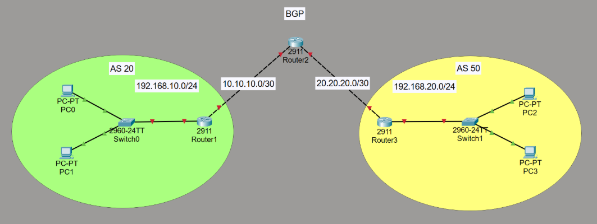
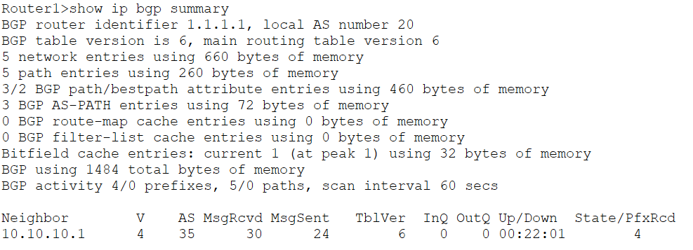
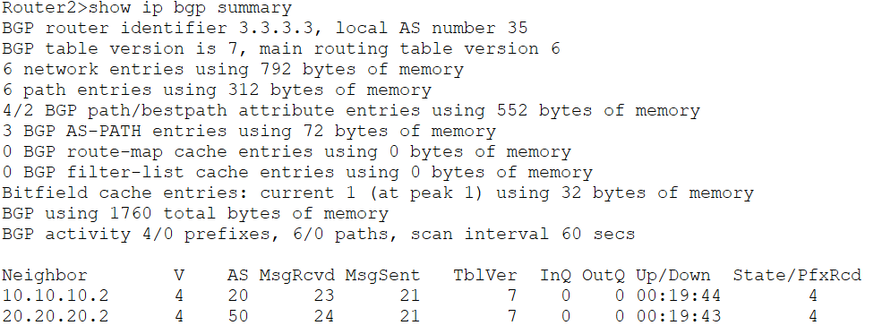
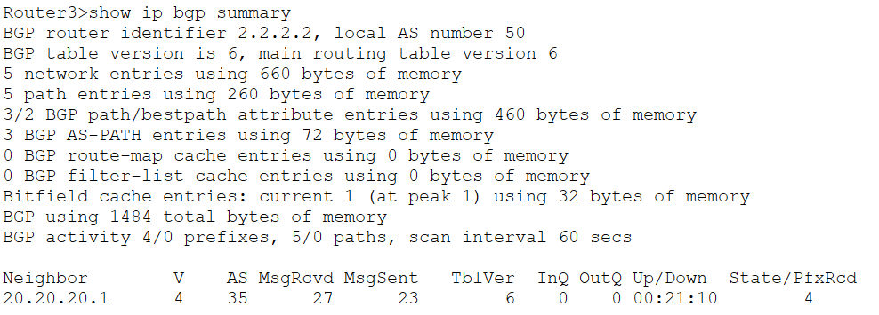
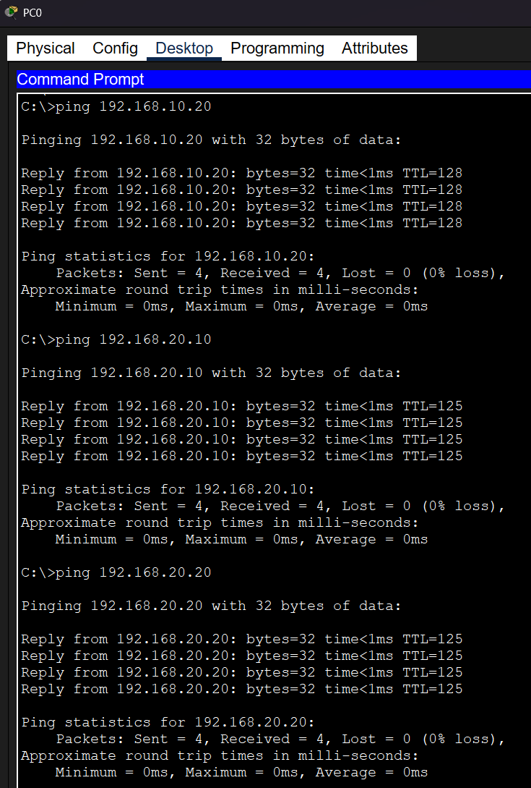
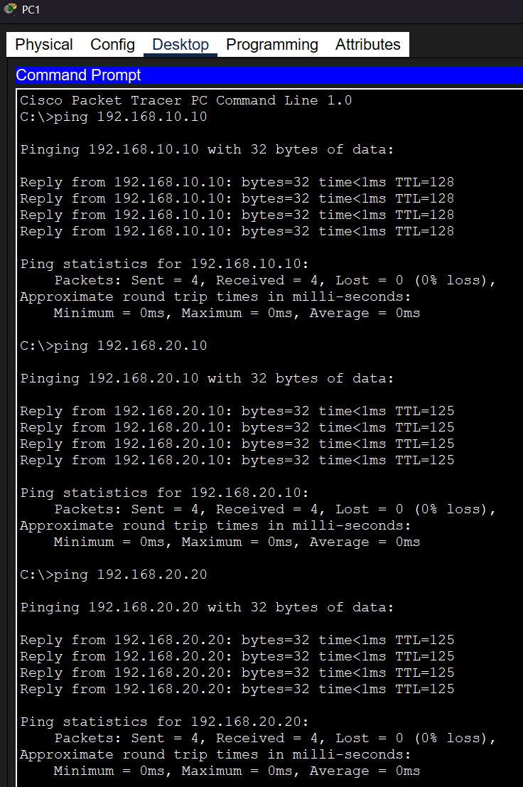
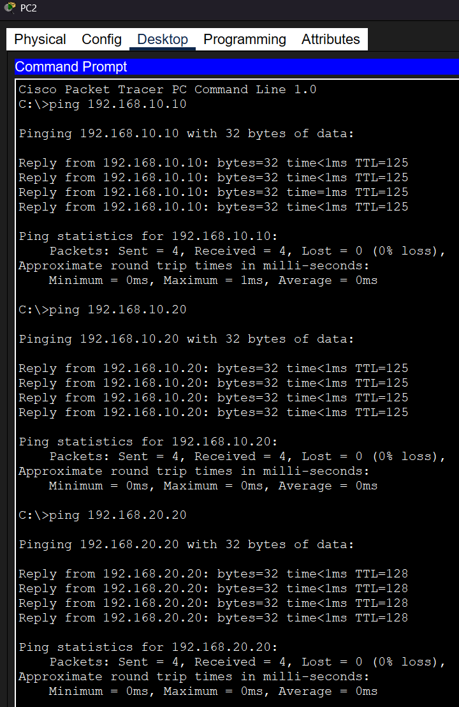
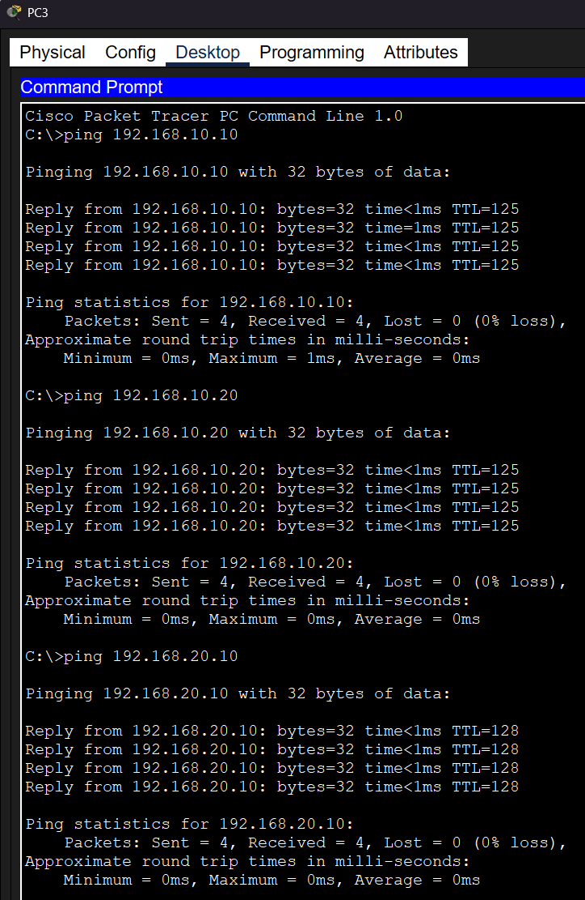
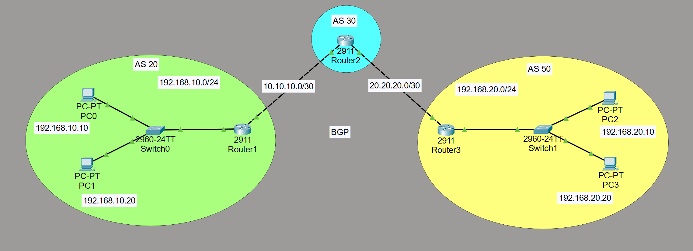

# eBGP Lab — Cisco Packet Tracer

A hands-on Border Gateway Protocol (BGP) lab built in Cisco Packet Tracer, demonstrating eBGP peering across three autonomous systems with end-to-end connectivity between PCs in different networks.

**Reference walkthrough:** [YouTube Tutorial](https://www.youtube.com/watch?v=WvmfhFH9PlU)

---

## Table of Contents

- [Step 1 — Draw the Topology and Overview](#step-1--draw-the-topology-and-overview)
- [Step 2 — Configure Router IP Addresses](#step-2--configure-router-ip-addresses)
- [Step 3 — Configure PC IP Addresses](#step-3--configure-pc-ip-addresses)
- [Step 4 — Configure BGP on Routers](#step-4--configure-bgp-on-routers)
- [Step 5 — Verify BGP Connections](#step-5--verify-bgp-connections)
- [Step 6 — Ping Across the Network](#step-6--ping-across-the-network)
- [What I Learned](#what-i-learned)


---

## Step 1 — Draw the Topology and Overview

Three autonomous systems connected via eBGP, with Router2 (AS 35) acting as the transit hub between AS 20 and AS 50.

### Physical Connections

| Connection | Interface A | Interface B |
|------------|------------|------------|
| Router1 ↔ Router2 | Gi0/0 | Gi0/0 |
| Router2 ↔ Router3 | Gi0/1 | Gi0/0 |
| Switch0 ↔ Router1 | Gi0/1 | Gi0/1 |
| Switch1 ↔ Router3 | Gi0/1 | Gi0/1 |
| PC0 ↔ Switch0 | Fa0 | Fa0/1 |
| PC1 ↔ Switch0 | Fa0 | Fa0/2 |
| PC2 ↔ Switch1 | Fa0 | Fa0/1 |
| PC3 ↔ Switch1 | Fa0 | Fa0/2 |



---

## Step 2 — Configure Router IP Addresses

- **WAN links (router-to-router):** subnet mask `255.255.255.252` (/30)
- **LAN links (router-to-switch):** subnet mask `255.255.255.0` (/24)

### Router2 (AS 35 — Transit)

| Port | IP Address | Subnet |
|------|-----------|--------|
| GigabitEthernet0/0 | 10.10.10.1 | /30 |
| GigabitEthernet0/1 | 20.20.20.1 | /30 |

### Router1 (AS 20)

| Port | IP Address | Subnet |
|------|-----------|--------|
| GigabitEthernet0/0 | 10.10.10.2 | /30 |
| GigabitEthernet0/1 | 192.168.10.1 | /24 |

### Router3 (AS 50)

| Port | IP Address | Subnet |
|------|-----------|--------|
| GigabitEthernet0/0 | 20.20.20.2 | /30 |
| GigabitEthernet0/1 | 192.168.20.1 | /24 |

---

## Step 3 — Configure PC IP Addresses

| Device | IP Address | Gateway | Subnet |
|--------|------------|---------|--------|
| PC0 | 192.168.10.10/24 | 192.168.10.1 | /24 |
| PC1 | 192.168.10.20/24 | 192.168.10.1 | /24 |
| PC2 | 192.168.20.10/24 | 192.168.20.1 | /24 |
| PC3 | 192.168.20.20/24 | 192.168.20.1 | /24 |

---

## Step 4 — Configure BGP on Routers

BGP is configured on each router with its AS number, a unique router-id, neighbor relationships, and the networks it advertises.

### Router1 — AS 20

```
Router1> enable
Router1# config terminal
Router1(config)# router bgp 20
Router1(config-router)# bgp router-id 1.1.1.1
Router1(config-router)# neighbor 10.10.10.1 remote-as 35
Router1(config-router)# network 192.168.10.0 mask 255.255.255.0
Router1(config-router)# network 10.10.10.0 mask 255.255.255.252
```

### Router3 — AS 50

```
Router3> enable
Router3# config terminal
Router3(config)# router bgp 50
Router3(config-router)# bgp router-id 2.2.2.2
Router3(config-router)# neighbor 20.20.20.1 remote-as 35
Router3(config-router)# network 192.168.20.0 mask 255.255.255.0
Router3(config-router)# network 20.20.20.0 mask 255.255.255.252
Router3(config-router)# exit
Router3(config)# do wr
```

### Router2 — AS 35 (Transit)

```
Router2> enable
Router2# config terminal
Router2(config)# router bgp 35
Router2(config-router)# bgp router-id 3.3.3.3
Router2(config-router)# neighbor 10.10.10.2 remote-as 20
Router2(config-router)# neighbor 20.20.20.2 remote-as 50
Router2(config-router)# network 10.10.10.0 mask 255.255.255.252
Router2(config-router)# network 20.20.20.0 mask 255.255.255.252
Router2(config-router)# exit
Router2(config)# do wr
```

> **Note:** When Router2's neighbors were configured, the console immediately showed `%BGP-5-ADJCHANGE: neighbor X.X.X.X Up`, confirming the eBGP sessions came up automatically.

---

## Step 5 — Verify BGP Connections

Run `show ip bgp summary` on each Router to confirm both neighbor sessions are established. Can also run `show ip bgp neighbor` for a more detailed description.







Key fields to check in the output:
- **State/PfxRcd** — shows `4` (number of prefixes received), meaning the session is active and routes are being exchanged
- **Up/Down** — shows session uptime, confirming the peering is stable
- **AS** — confirms the correct remote AS numbers (20 and 50)

Both neighbors (`10.10.10.2` and `20.20.20.2`) showed State/PfxRcd of `4`, confirming full BGP adjacency.

---

## Step 6 — Ping Across the Network

After BGP converges, end-to-end connectivity was tested by pinging across AS boundaries from each PC.

### PC0 → PC1 (same AS) and PC0 → PC2/PC3 (cross-AS)



### PC1 Ping Results



### PC2 Ping Results



### PC3 Ping Results



All pings succeeded with 0–1ms latency. The first ping to PC3 (192.168.20.20) from PC0 showed 1 packet loss due to ARP resolution — expected behavior on the first packet.

### Final Topology with IP Labels



---

## What I Learned

### BGP Fundamentals
- **eBGP vs. iBGP** — External BGP connects routers in *different* autonomous systems. Unlike OSPF or EIGRP, BGP requires neighbors to be manually defined; it does not auto-discover peers. I was unable to test iBGP in Packet Tracer as it is not supported in the software.
- **Autonomous Systems** — Each AS is identified by a unique number. AS numbers 1–64511 are public; 64512–65535 are private. This lab used AS 20, 35, and 50.
- **BGP Router-ID** — A unique identifier (loopback-style IP) used to identify each BGP speaker in the network.

### Configuration
- The `neighbor X.X.X.X remote-as` command establishes a peer relationship. The remote-as number must match what the neighbor is actually configured with, or the session won't come up.
- BGP only advertises networks explicitly listed with the `network` command (unlike OSPF which advertises all connected interfaces). The network/mask must exactly match what's in the routing table.
- `/30` subnets are standard for point-to-point WAN links — they provide only 2 usable host addresses, minimizing IP waste.

### Verification & Troubleshooting
- `show ip bgp summary` is the go-to command to confirm neighbor state. A numeric value in the **State/PfxRcd** column means the session is up; a word like `Active` or `Idle` means it's not.
- `show ip bgp neighbors` gives detailed session info including timers, capabilities, and message counts.
- BGP convergence takes longer than IGPs — waiting a few seconds after configuration before testing is normal.

### Networking Concepts Reinforced
- Subnet mask `/30` = `255.255.255.252` — only 2 host addresses per link
- Subnet mask `/24` = `255.255.255.0` — standard LAN subnet
- TTL in ping responses indicates hop count: TTL=128 means same subnet (Windows default 128 minus 0 hops), TTL=125 means 3 hops across AS boundaries

---

## Tools Used

- **Cisco Packet Tracer** — Network simulation
- **Cisco IOS** — Router/switch operating system
- **BGP (Border Gateway Protocol)** — Inter-AS routing protocol

## Skills Demonstrated

`BGP` `eBGP` `Cisco IOS` `IP Addressing` `Subnetting` `Routing Protocols` `Network Topology` `Packet Tracer` `WAN Configuration` `LAN Configuration`
